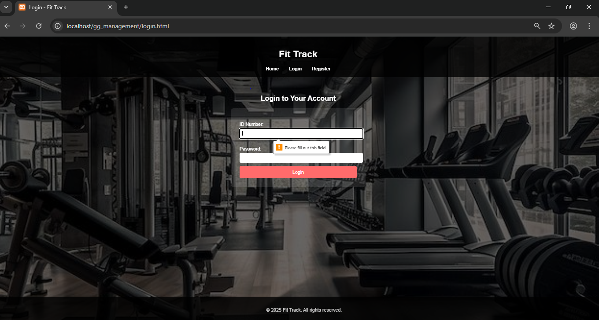

# Gym Management System

A web-based Gym Management System designed to manage clients, classes, payments, and reports with a simple and intuitive interface.

## 🚀 Features

- 👥 Client registration and login
- 📊 Admin dashboard with class and user management
- 📅 Class booking and scheduling
- 💰 MPESA payments via Safaricom Daraja API

---

## 🖼️ Screenshots

### 🔐 Login Page

### 🧑‍💼 Admin Dashboard

### 📅 Class Booking

### 💳 Payment Page

---

## 🛠️ Tech Stack

- PHP
- MySQL
- HTML/CSS/JavaScript
- Git & GitHub
- MPESA Daraja API (Safaricom)

---

## ⚙️ Setup Instructions

1. Clone this repository
2. Import the SQL file into phpMyAdmin
3. Configure database in `db_connect.php`
4. Run using XAMPP or similar

---

## 👤 Author

**Dev-Carlyne**  
[GitHub Profile](https://github.com/Dev-Carlyne)
